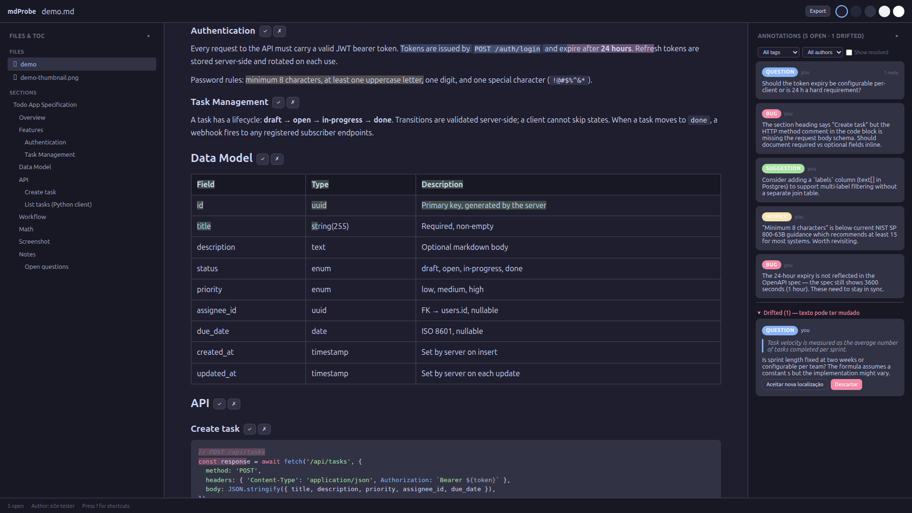
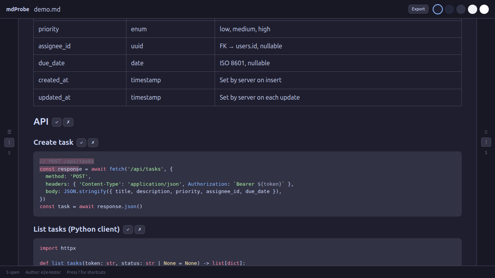
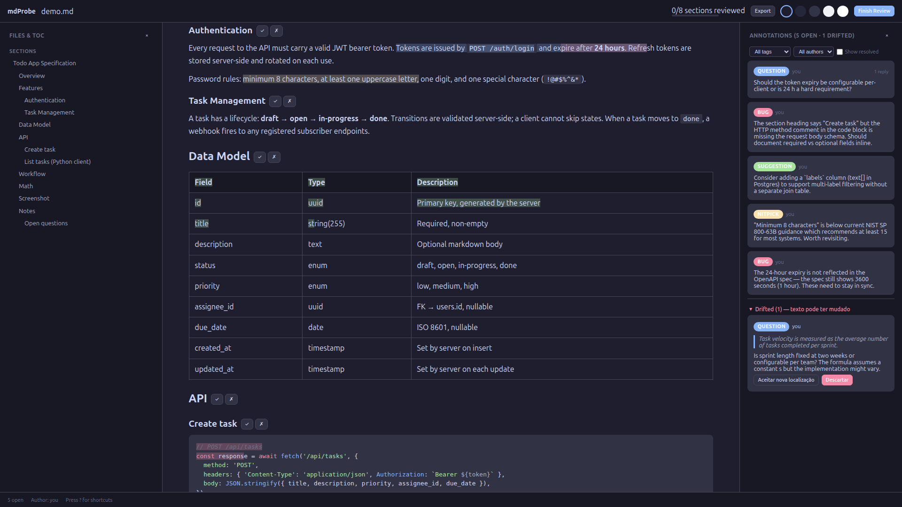
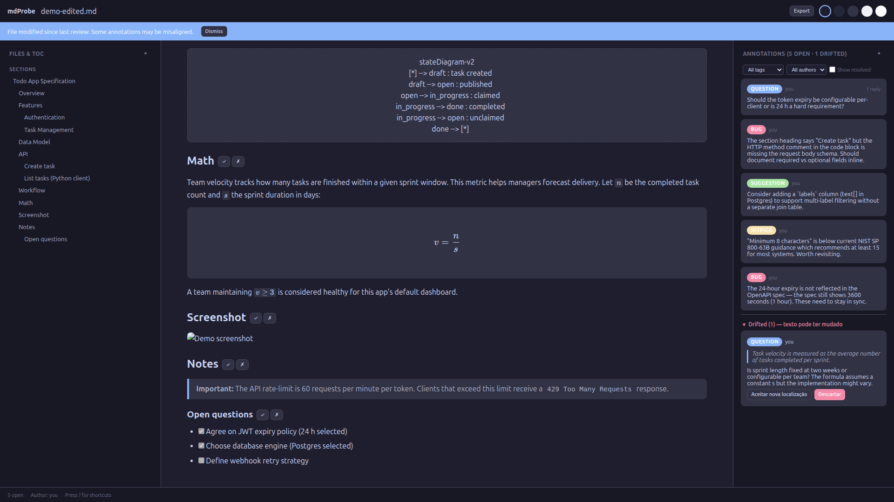
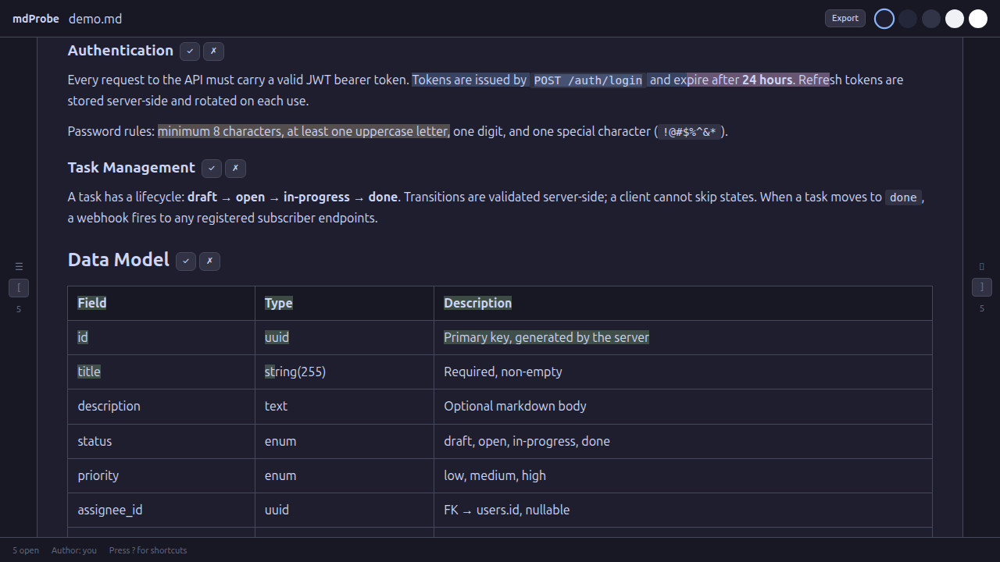

<p align="center">
  
</p>

# mdProbe

[](https://www.npmjs.com/package/@henryavila/mdprobe)
[](LICENSE)

Markdown viewer and reviewer with live reload, persistent annotations, and AI agent integration.

[🇧🇷 Leia em Português](README.pt-BR.md)

Open `.md` files in the browser, annotate inline, approve sections, and export structured feedback as YAML — all from the terminal. Works standalone or as an MCP server for AI agents (Claude Code, Cursor, etc.).

---

## What mdProbe is

- A **CLI tool** that renders Markdown in the browser with live reload
- An **annotation system** where you select text and add tagged comments (bug, question, suggestion, nitpick)
- A **review workflow** with section-level approval (approve/reject per heading)
- An **MCP server** that lets AI agents open files, read annotations, and resolve feedback programmatically

## What mdProbe is not

- Not a Markdown editor — you edit in your own editor, mdProbe renders and annotates
- Not a static site generator — it runs a local server for live preview
- Not exclusive to AI — works perfectly as a standalone review tool

---

## Quick Start

```bash
npm install -g @henryavila/mdprobe
mdprobe setup
mdprobe README.md
```

Or run without installing:

```bash
npx @henryavila/mdprobe README.md
```

**Requirements:** Node.js 20+, a modern browser (see [Browser Requirements](#browser-requirements)).

---

## Annotations 101

Select any text in the browser, choose a tag, write a comment, and save.



| Tag | Meaning |
|-----|---------|
| `bug` | Something is wrong |
| `question` | Needs clarification |
| `suggestion` | Improvement idea |
| `nitpick` | Minor style/wording |

### Annotation states

| State | Meaning |
|-------|---------|
| `open` | Active annotation, anchored confidently |
| `drifted` | Source text changed; annotation was re-located with fuzzy match but requires human confirmation (shown with dashed amber underline) |
| `orphan` | Anchor failed completely after all recovery steps; surfaced in a side panel section without inline highlight |
| `resolved` | Addressed; greyed out |

Annotations are stored in `.annotations.yaml` sidecar files — human-readable, git-friendly. See [docs/SCHEMA.md](docs/SCHEMA.md) for the full schema reference.

---

## Workflows

### 5.1. Standalone live preview (foreground)

```bash
mdprobe README.md      # Open a single file
mdprobe docs/          # Discover all .md files recursively
```

Starts a server, opens the browser, and watches the source file for changes. Edit in your editor — the browser updates instantly. Press `Ctrl+C` to stop.

Multiple calls share the same running server: a second `mdprobe` invocation detects the existing process via lock file, adds its files via `POST /api/add-files`, and exits — so you never accumulate stale processes.

### 5.2. Background server (`-d` / `--detach`)

```bash
mdprobe -d docs/            # Start in background, exit immediately
mdprobe CHANGELOG.md        # Join the running server, add the file
mdprobe stop                # Kill the server and clean the lock file
```

`-d`/`--detach` starts the server process detached from the terminal. Subsequent invocations join it normally. Use `mdprobe stop` (or `mdprobe stop --force`) to shut it down.

### 5.3. Blocking review for CI (`--once`)

```bash
mdprobe spec.md --once
```



Blocks the process until you click **"Finish Review"** in the UI. Exits with the list of created annotation files — useful for pipelines that need human sign-off before continuing. `--once` always creates an isolated server instance (does not join the singleton).

### 5.4. AI-assisted review (MCP)

When working with AI agents, the agent uses the MCP tools instead of `--once`:

```
Agent writes spec.md
    ↓
Agent calls mdprobe_view → browser opens, server stays running
    ↓
Human reads, annotates, approves/rejects sections
    ↓
Human tells agent via chat: "done reviewing"
    ↓
Agent calls mdprobe_annotations → reads all feedback
    ↓
Agent fixes bugs, answers questions, evaluates suggestions
    ↓
Agent reports changes, asks human to confirm
    ↓
Agent calls mdprobe_update → resolves annotations
    ↓
Human sees resolved items in real-time (greyed out)
```

The server stays running across the entire conversation. Multiple files can be reviewed in the same session.

### 5.5. Updating

```bash
mdprobe update              # interactive: confirms before installing
mdprobe update --yes        # skip the confirmation prompt
mdprobe update --dry-run    # show what would happen, don't install
mdprobe update --force      # reinstall even if already on latest
```

Detects your package manager (npm/pnpm/yarn/bun), stops the running server if any, installs the latest version, and prints "What's new" from the new release's changelog.

When a new release is available, mdProbe also shows a discreet banner at startup. To silence it: `export NO_UPDATE_NOTIFIER=1`. The banner is automatically suppressed in CI, in pipes, and during `--once` mode.

---

## Features

### Rendering

GFM tables, syntax highlighting (highlight.js), Mermaid diagrams, math/LaTeX (KaTeX), YAML/TOML frontmatter, raw HTML passthrough, images from source directory.

### Live Reload

File changes detected via chokidar, pushed over WebSocket. Debounced at 100ms. Scroll position preserved.

### Section Approval

Every heading gets approve/reject buttons. Approving a parent cascades to all children. Progress bar tracks reviewed vs total sections.

### Drift Recovery

When the source file changes after annotations were created, mdProbe runs a 5-step pipeline to re-locate each annotation span:

```
1. Hash check   — file unchanged? use stored offsets directly (~0ms)
2. Exact match  — quote text still appears uniquely in source
3. Fuzzy match  — Myers bit-parallel, threshold ≥ 0.60 within ±2 kB window
4. Tree path    — heading + paragraph fingerprint via mdast
5. Keyword dist — rare-word anchors as last resort
→ confident / drifted / orphan
```

`drifted` annotations show a dashed amber underline and require your explicit confirmation (`acceptDrift`) before being re-anchored as `open`. `orphan` annotations appear in a dedicated panel section without inline highlight.



### Char-precise Highlighting

v0.5.0 uses the **CSS Custom Highlight API** (zero DOM mutation) to render annotation marks. Selections are anchored by UTF-16 character offsets in the raw Markdown source, not by line/column numbers — so cross-block selections, reformatted code, and paragraph-wrapping edits don't break anchors silently.



### Themes

Five themes based on Catppuccin: Mocha (dark, default), Macchiato, Frappe, Latte, Light.

### Keyboard Shortcuts

| Key | Action |
|-----|--------|
| `[` | Toggle left panel (files + TOC) |
| `]` | Toggle right panel (annotations) |
| `\` | Focus mode (hide both panels) |
| `j` / `k` | Next / previous annotation |
| `?` | Help overlay |
| `Ctrl+Enter` | Save annotation |

### Export

```bash
mdprobe export spec.md --report   # Markdown review report
mdprobe export spec.md --inline   # Annotations inserted into source
mdprobe export spec.md --json     # Plain JSON (v2 schema)
mdprobe export spec.md --sarif    # SARIF 2.1.0 (CI/CD integration)
```

---

## Browser Requirements

v0.5.0 requires the **CSS Custom Highlight API** for inline annotation rendering.

| Browser | Minimum version |
|---------|----------------|
| Chrome / Edge | 105+ |
| Firefox | 140+ |
| Safari | 17.2+ |

On older browsers mdProbe shows a modal explaining the limitation and falls back to a read-only annotation list. Inline highlights are disabled.

---

## CLI Reference

```
mdprobe [files...] [options]

Options:
  --port <n>         Port number (default: 3000, auto-increments if busy)
  --once             Blocking review — isolated server, exits on "Finish Review"
  -d, --detach       Start server in background and exit
  --no-open          Don't auto-open browser
  --help, -h         Show help
  --version, -v      Show version

Subcommands:
  setup                         Interactive setup (skill + MCP + hook)
  setup --remove                Uninstall everything
  setup --yes [--author <name>] Non-interactive setup
  mcp                           Start MCP server (stdio, for AI agents)
  config [key] [value]          Manage configuration
  export <path> [flags]         Export annotations (--report, --inline, --json, --sarif)
  migrate <path> [--dry-run]    Batch migrate v1 annotations to v2
  stop [--force]                Kill singleton server and clean lock file
```

---

## AI Agent Integration

<p align="center">
  
</p>

mdProbe includes an MCP server and a `SKILL.md` that teaches AI agents the review workflow. This enables a two-way loop: the agent writes Markdown, the human annotates, the agent reads feedback and resolves it.

### Setup

```bash
mdprobe setup
```

Interactive wizard that:
1. Installs `SKILL.md` to detected IDEs (Claude Code, Cursor, Gemini)
2. Registers the MCP server (`mdprobe mcp`) in Claude Code (`~/.claude.json` or `claude mcp`) and in Cursor (`~/.cursor/mcp.json` when that folder exists)
3. Migrates legacy Claude PostToolUse hooks from older mdprobe versions (if any)
4. Configures your author name

Non-interactive: `mdprobe setup --yes --author "Your Name"`  
Remove everything: `mdprobe setup --remove`

### MCP Tools

| Tool | Purpose |
|------|---------|
| `mdprobe_view` | Open `.md` files in the browser |
| `mdprobe_annotations` | Read annotations and section statuses |
| `mdprobe_update` | Resolve, reply, add, or delete annotations |
| `mdprobe_status` | Check if the server is running |

### Manual MCP Registration

If you prefer not to use `mdprobe setup`:

**Claude Code**

```bash
claude mcp add --scope user --transport stdio mdprobe -- mdprobe mcp
```

**Cursor** — merge into `~/.cursor/mcp.json` (or project `.cursor/mcp.json`):

```json
{
  "mcpServers": {
    "mdprobe": { "command": "mdprobe", "args": ["mcp"] }
  }
}
```

**WSL + Cursor on Windows:** Node's home is your Linux home (e.g. `/home/you`), while the Cursor desktop app reads MCP from the Windows profile (`%USERPROFILE%\.cursor\mcp.json`). When you run `mdprobe setup` inside WSL, it writes both `~/.cursor/mcp.json` (Linux) and, via `/mnt/c/...`, the Windows `mcp.json` with a `wsl.exe` bridge to your Linux `mdprobe` binary. `WSL_DISTRO_NAME` and `cmd.exe` must be available (normal WSL2 install).

---

## Migration v0.4 → v0.5

Schema v1 used `selectors.position { startLine, startColumn, endLine, endColumn }`. v0.5.0 replaces this with `range { start, end }` (UTF-16 character offsets), which is more precise and survives line-wrapping edits.

**Automatic:** `AnnotationFile.load()` detects v1 files and migrates them in-place, writing a `.bak` backup first (e.g. `spec.annotations.yaml.bak`).

**Batch (recommended before upgrading a large repo):**

```bash
mdprobe migrate docs/ --dry-run   # Preview changes without writing
mdprobe migrate docs/             # Apply migration
```

**Rollback:** restore the `.bak` file alongside the `.annotations.yaml` file.

See [docs/SCHEMA.md](docs/SCHEMA.md) for the full v2 field reference.

---

## Library & HTTP API

mdProbe ships as an npm package you can embed in your own server — no separate process needed.

- **[docs/EMBEDDING.md](docs/EMBEDDING.md)** — `createHandler` (Express/Node middleware), `AnnotationFile` class, export helpers, anchoring utilities
- **[docs/HTTP-API.md](docs/HTTP-API.md)** — full REST + WebSocket endpoint reference
- **[docs/SCHEMA.md](docs/SCHEMA.md)** — annotation YAML schema v2, field-by-field reference
- **[docs/ARCHITECTURE.md](docs/ARCHITECTURE.md)** — project structure, rendering pipeline, key design decisions

---

## Development

```bash
git clone https://github.com/henryavila/mdprobe.git
cd mdprobe
npm install
npm run build:ui
npm test
```

For project structure and architecture details see [docs/ARCHITECTURE.md](docs/ARCHITECTURE.md).

---

## License

MIT © [Henry Avila](https://github.com/henryavila)
