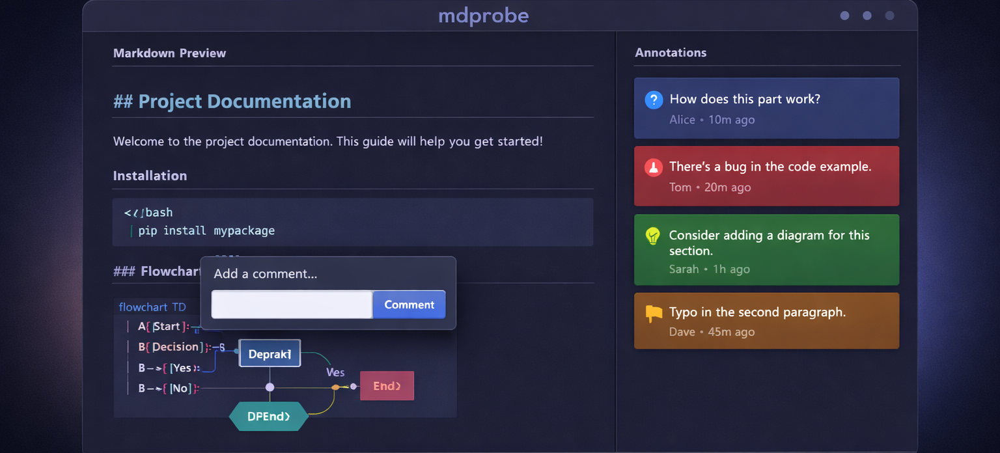

# mdprobe

**The missing link between AI coding agents and human review.**

AI agents generate specs, docs, and RFCs — but you need to actually *read* them, *annotate* them, and *send structured feedback back*. mdprobe closes that loop: it renders markdown in the browser, lets you annotate inline, and returns structured YAML that agents can parse and act on.

It works standalone too — as a markdown viewer with live reload and persistent annotations for any review workflow.

[Install](#install) | [Quick Start](#quick-start) | [Features](#features) | [CLI Reference](#cli-reference) | [Library API](#library-api) | [Schema](#annotation-schema) | [AI Integration](#ai-agent-integration)

---

## What is mdprobe?

A CLI tool that turns markdown files into a review environment in your browser.

```
AI Agent writes spec.md ──> mdprobe spec.md --once ──> Human reviews & annotates ──> spec.annotations.yaml ──> Agent reads feedback
```

### The problem

AI agents produce markdown output (specs, architecture docs, RFCs) but have no way to get **structured, line-level feedback** from humans. You either paste comments back into chat (losing context) or approve blindly.

### The solution

mdprobe renders your markdown with full GFM, syntax highlighting, Mermaid diagrams and math, then lets you select text and add annotations — `bug`, `question`, `suggestion`, `nitpick` — that are saved as a YAML sidecar. In `--once` mode, the agent's process blocks until you finish reviewing, then reads the annotations programmatically.

It also works as a standalone tool for any markdown review workflow — no AI required.

### Three workflows

| Workflow | Command | Use case |
|----------|---------|----------|
| **View** | `mdprobe spec.md` | Render complex markdown in the browser with live reload |
| **Review** | `mdprobe spec.md --once` | Agent blocks until human finishes annotating, then reads feedback |
| **Embed** | `import { createHandler }` | Mount mdprobe inside your own Node.js server or tool |

Annotations are stored as plain YAML — readable by humans, parseable by machines, and version-controllable with git.

---

## Install

```bash
npm install -g @henryavila/mdprobe
```

Or use directly with npx:

```bash
npx @henryavila/mdprobe spec.md
```

### Requirements

- Node.js 20+
- A browser (auto-opens on macOS, Linux, and WSL)

---

## Quick Start

### View a file

```bash
mdprobe README.md
```

Opens the rendered markdown in your browser. Edit the file in your editor — the browser updates instantly.

### View a directory

```bash
mdprobe docs/
```

Discovers all `.md` files recursively and shows a file picker.

### Review mode (blocking)

```bash
mdprobe spec.md --once
```

The process **blocks** until you click "Finish Review" in the UI. Annotations are saved to `spec.annotations.yaml`. Useful for AI agents that need human feedback before continuing.

### Configure your name

```bash
mdprobe config author "Your Name"
```

Your name is attached to every annotation and reply. On first use, mdprobe will prompt you interactively.

---

## Features

### Markdown Rendering

- **GFM** — tables, task lists, strikethrough, autolinks
- **Syntax highlighting** — all languages via highlight.js
- **Mermaid diagrams** — rendered client-side
- **Math/LaTeX** — via KaTeX (inline and display)
- **Frontmatter** — YAML and TOML (parsed and stripped from output)
- **Raw HTML** — passthrough with allowlist
- **Images** — served from the markdown file's directory

### Live Reload

File changes are detected via chokidar and pushed to the browser over WebSocket. Debounced at 100ms to avoid flicker during rapid saves. Scroll position is preserved across reloads.

### Annotations

Select any text in the rendered markdown to open the annotation popover:

- **4 tags**: `bug`, `question`, `suggestion`, `nitpick` — color-coded pills
- **Threaded replies** — discuss annotations inline
- **Resolve/reopen** — mark items as handled
- **Persistent** — saved to `.annotations.yaml` sidecar (YAML format, git-friendly)
- **Draggable popover** — move the form to read the content underneath
- **Keyboard shortcuts** — `Ctrl+Enter` to save, `Esc` to close

### Section Approval

Every heading in your document gets approve/reject buttons:

- **Symmetric cascade** — approving a parent approves all children; rejecting or resetting does the same
- **Indeterminate state** — when children have mixed statuses, the parent shows a visual indicator
- **Approve All / Clear All** — bulk operations for the entire document

### Drift Detection

When the source markdown changes after annotations were created, mdprobe shows a warning banner. This prevents stale annotations from going unnoticed.

### Themes

Five built-in themes based on the Catppuccin palette:

| Theme | Style |
|-------|-------|
| **Mocha** | Dark (default) |
| **Macchiato** | Dark, warm |
| **Frappe** | Dark, deep blue |
| **Latte** | Light |
| **Light** | Pure white |

### Keyboard Shortcuts

| Key | Action |
|-----|--------|
| `[` | Toggle left panel (files + TOC) |
| `]` | Toggle right panel (annotations) |
| `\` | Toggle both panels (focus mode) |
| `j` / `k` | Next / previous annotation |
| `?` | Show help overlay |
| `Ctrl+Enter` | Save annotation |
| `Esc` | Close popover / modal |

### Export

Export annotations in four formats:

```bash
mdprobe export spec.md --report   # Markdown review report
mdprobe export spec.md --inline   # HTML comments inserted into source
mdprobe export spec.md --json     # Plain JSON
mdprobe export spec.md --sarif    # SARIF 2.1.0 (for CI/CD integration)
```

Also available via the HTTP API: `GET /api/export?path=spec.md&format=json`

---

## CLI Reference

```
mdprobe [files...] [options]

Options:
  --port <n>      Port number (default: 3000, auto-increments if busy)
  --once          Review mode — blocks until human finishes
  --no-open       Don't auto-open browser
  --help, -h      Show help
  --version, -v   Show version

Subcommands:
  config [key] [value]           Manage configuration
  export <path> [format-flag]    Export annotations
  install --plugin               Install Claude Code skill
```

### Config

```bash
mdprobe config                  # Show all configuration
mdprobe config author           # Show current author
mdprobe config author "Name"    # Set author
```

Configuration is stored in `~/.mdprobe.json`.

---

## Library API

### Embedding in your own server

```javascript
import { createHandler } from '@henryavila/mdprobe'

const handler = createHandler({
  resolveFile: (req) => '/path/to/file.md',
  listFiles: () => [
    { id: 'spec', path: '/docs/spec.md', label: 'Specification' },
    { id: 'adr', path: '/docs/adr.md', label: 'Architecture Decision' },
  ],
  basePath: '/review',
  author: 'Review Bot',
  onComplete: (result) => {
    console.log(`Review done: ${result.annotations} annotations`)
  },
})

import http from 'node:http'
http.createServer(handler).listen(3000)
```

### Working with annotations programmatically

```javascript
import { AnnotationFile } from '@henryavila/mdprobe/annotations'

// Load existing annotations
const af = await AnnotationFile.load('spec.annotations.yaml')

// Query
const open = af.getOpen()
const bugs = af.getByTag('bug')
const mine = af.getByAuthor('Henry')

// Mutate
af.add({
  selectors: {
    position: { startLine: 10, startColumn: 1, endLine: 10, endColumn: 40 },
    quote: { exact: 'selected text', prefix: '', suffix: '' },
  },
  comment: 'This needs clarification',
  tag: 'question',
  author: 'Henry',
})
af.resolve(bugs[0].id)

// Persist
await af.save('spec.annotations.yaml')

// Export
import { exportJSON, exportSARIF } from '@henryavila/mdprobe/export'
const json = exportJSON(af)
const sarif = exportSARIF(af, 'spec.md')
```

---

## Annotation Schema

Annotations are stored in YAML sidecar files (`<filename>.annotations.yaml`):

```yaml
version: 1
source: spec.md
source_hash: "sha256:abc123..."
sections:
  - heading: Introduction
    level: 2
    status: approved
  - heading: Requirements
    level: 2
    status: pending
annotations:
  - id: "a1b2c3d4"
    selectors:
      position:
        startLine: 15
        startColumn: 1
        endLine: 15
        endColumn: 42
      quote:
        exact: "The system shall support concurrent users"
        prefix: ""
        suffix: ""
    comment: "How many concurrent users? Need a number."
    tag: question
    status: open
    author: Henry
    created_at: "2026-04-08T10:30:00.000Z"
    updated_at: "2026-04-08T10:30:00.000Z"
    replies:
      - author: Alice
        comment: "Target is 500 concurrent."
        created_at: "2026-04-08T11:00:00.000Z"
```

A JSON Schema is available at `@henryavila/mdprobe/schema.json` for validation.

### Tags

| Tag | Meaning | SARIF Severity |
|-----|---------|----------------|
| `bug` | Something is wrong | error |
| `question` | Needs clarification | note |
| `suggestion` | Improvement idea | warning |
| `nitpick` | Minor style/wording | note |

---

## AI Agent Integration

mdprobe ships with a Claude Code skill that teaches the AI when and how to use it.

### Install the skill

```bash
mdprobe install --plugin
```

### Agent workflow

1. Agent writes a spec/document to a `.md` file
2. Agent launches `mdprobe spec.md --once` (blocks)
3. Human reviews in the browser, adds annotations
4. Human clicks "Finish Review"
5. Agent reads `spec.annotations.yaml` and addresses each annotation

```javascript
// Agent reads feedback after review
import { AnnotationFile } from '@henryavila/mdprobe/annotations'

const af = await AnnotationFile.load('spec.annotations.yaml')
for (const ann of af.getOpen()) {
  console.log(`[${ann.tag}] Line ${ann.selectors.position.startLine}: ${ann.comment}`)
}
```

---

## HTTP API

All endpoints are available when the server is running.

| Method | Endpoint | Description |
|--------|----------|-------------|
| `GET` | `/api/files` | List markdown files |
| `GET` | `/api/file?path=<file>` | Get rendered HTML + TOC + frontmatter |
| `GET` | `/api/annotations?path=<file>` | Get annotations + sections + drift status |
| `POST` | `/api/annotations` | Create/update/delete annotations |
| `POST` | `/api/sections` | Approve/reject/reset sections |
| `GET` | `/api/export?path=<file>&format=<fmt>` | Export (json, report, inline, sarif) |
| `GET` | `/api/config` | Get current author |

WebSocket at `/ws` provides real-time file change notifications.

---

## Development

```bash
git clone https://github.com/henryavila/mdprobe.git
cd mdprobe
npm install
npm run build:ui    # Build the Preact UI
npm test            # Run test suite (489 tests)
```

### Project structure

```
bin/cli.js              CLI entry point
src/
  server.js             HTTP + WebSocket server
  renderer.js           Markdown rendering pipeline (remark/rehype)
  annotations.js        Annotation CRUD + section approval + cascade
  export.js             4 export formats (report, inline, JSON, SARIF)
  handler.js            Library API for embedding
  config.js             User configuration (~/.mdprobe.json)
  hash.js               SHA-256 drift detection
  anchoring.js          Text position matching for highlights
  ui/
    components/         Preact components (App, Content, Popover, Panels...)
    hooks/              Custom hooks (WebSocket, keyboard, theme, annotations)
    state/store.js      Preact Signals state management
    styles/themes.css   Catppuccin theme system
schema.json             JSON Schema for annotation YAML
skills/                 Claude Code integration skill
```

---

## License

MIT © [Henry Avila](https://github.com/henryavila)
