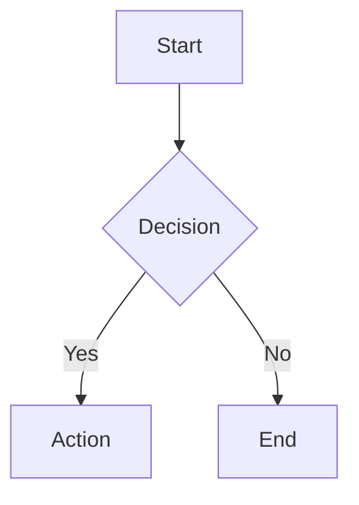

# Complex Markdown Test

## GFM Features

### Tables

| Feature | Status | Notes |
|---------|--------|-------|
| Tables  | ✅     | GFM   |
| Tasks   | ✅     | GFM   |

### Task Lists

- [x] Implemented tables
- [x] Implemented task lists
- [ ] Implement strikethrough

### Strikethrough

This is ~~deleted text~~ with strikethrough.

### Autolinks

Visit https://example.com for more info.

## Code Blocks

### JavaScript

```javascript
function hello(name) {
  console.log(`Hello, ${name}!`)
  return { greeting: `Hello, ${name}!` }
}
```

### Python

```python
def hello(name: str) -> dict:
    print(f"Hello, {name}!")
    return {"greeting": f"Hello, {name}!"}
```

## Mermaid Diagrams



## Math / KaTeX

Inline math: $E = mc^2$

Display math:

$$
\int_{-\infty}^{\infty} e^{-x^2} dx = \sqrt{\pi}
$$

## HTML Passthrough

<details>
<summary>Click to expand</summary>

This is hidden content with **bold** and *italic*.

</details>

## Images


## Mixed Content

Here is a paragraph with **bold**, *italic*, `code`, ~~strikethrough~~, and a [link](https://example.com).

> Blockquote with **formatted** text and `inline code`.

1. Ordered list item one
2. Ordered list item two
   - Nested unordered item
   - Another nested item

## Unicode & Emoji

Testing unicode: café, naïve, résumé, 日本語テスト

Special characters: & < > " ' © ® ™
