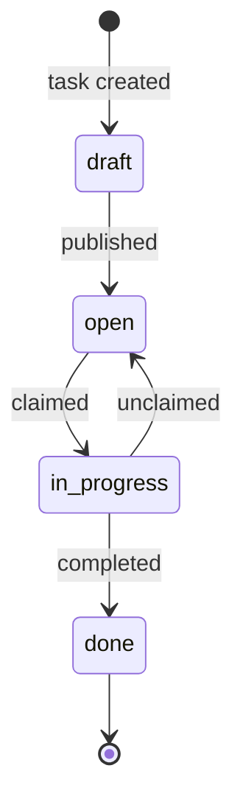

# Todo App Specification

A lightweight task-management app for individuals and small teams.
Built to demonstrate document review with inline annotations.

## Overview

The **Todo App** lets users create, assign, and track tasks through a
clean web interface. All data is stored in a single Postgres database
and exposed through a REST API. The frontend is a single-page app that
communicates over HTTP and WebSocket.

Supported platforms: modern desktop browsers (Chrome 120+, Firefox 118+, Safari 17+).

## Features

Users get the following capabilities out of the box:

- Create, edit, and delete tasks
- Assign tasks to team members
- Set due dates and priority levels (low / medium / high)
- Filter tasks by status, assignee, or label
- Receive real-time updates via WebSocket

### Authentication

Every request to the API must carry a valid JWT bearer token.
Tokens are issued by `POST /auth/login` and expire after **24 hours**.
Refresh tokens are stored server-side and rotated on each use.

Password rules: minimum 8 characters, at least one uppercase letter,
one digit, and one special character (`!@#$%^&*`).

### Task Management

A task has a lifecycle: **draft → open → in-progress → done**.
Transitions are validated server-side; a client cannot skip states.
When a task moves to `done`, a webhook fires to any registered
subscriber endpoints.

## Data Model

| Field        | Type        | Description                          |
|--------------|-------------|--------------------------------------|
| id           | uuid        | Primary key, generated by the server |
| title        | string(255) | Required, non-empty                  |
| description  | text        | Optional markdown body               |
| status       | enum        | draft, open, in-progress, done       |
| priority     | enum        | low, medium, high                    |
| assignee_id  | uuid        | FK → users.id, nullable              |
| due_date     | date        | ISO 8601, nullable                   |
| created_at   | timestamp   | Set by server on insert              |
| updated_at   | timestamp   | Set by server on each update         |

## API

### Create task

```javascript
// POST /api/tasks
const response = await fetch('/api/tasks', {
  method: 'POST',
  headers: { 'Content-Type': 'application/json', Authorization: `Bearer ${token}` },
  body: JSON.stringify({ title, description, priority, assignee_id, due_date }),
})
const task = await response.json()
```

### List tasks (Python client)

```python
import httpx

def list_tasks(token: str, status: str | None = None) -> list[dict]:
    params = {"status": status} if status else {}
    r = httpx.get("/api/tasks", headers={"Authorization": f"Bearer {token}"}, params=params)
    r.raise_for_status()
    return r.json()
```

## Workflow



## Math

Team velocity tracks how many tasks are finished within a given sprint window.
This metric helps managers forecast delivery. Let $n$ be the completed task count
and $s$ the sprint duration in days:

$$
v = \frac{n}{s}
$$

A team maintaining $v \geq 3$ is considered healthy for this app's default dashboard.

## Screenshot


## Notes

> **Important:** The API rate-limit is 60 requests per minute per token.
> Clients that exceed this limit receive a `429 Too Many Requests` response.

### Open questions

- [x] Agree on JWT expiry policy (24 h selected)
- [x] Choose database engine (Postgres selected)
- [ ] Define webhook retry strategy
